# Michał Muzyka 2.3 – Sprawozdanie Lab 5

### Tworzę namespace dla środowiska deweloperskiego i namespace dla środowiska produkcyjnego. Weryfikuję, czy zostały utworzone.

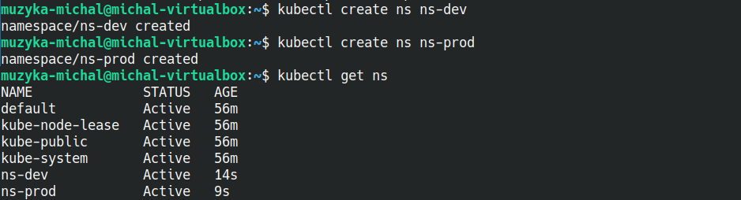

### Tworzę plik YAML ograniczenia zasobów ResourceQuota w przestrzeni nazw ns-prod.

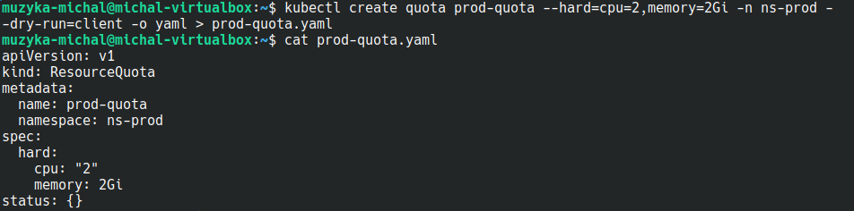

### Aplikuję plik YAML i sprawdzam poprawność konfiguracji.

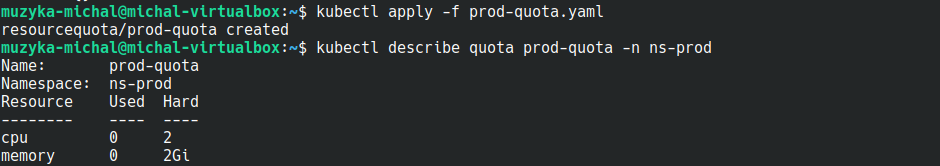

### Tworzę plik YAML ograniczenia zasobów ResourceQuota w przestrzeni nazw ns-dev (dostepne zasoby CPU i RAM dwa razy większe w ns-prod niż w ns-dev + ograniczenie do 10 podów w ns-dev). 

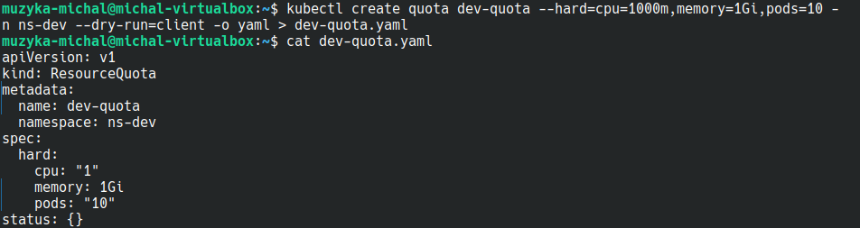

### Aplikuję plik YAML i sprawdzam poprawność konfiguracji.

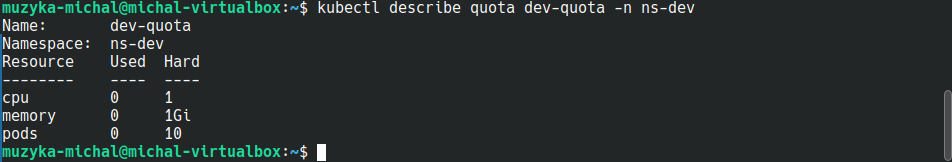

### W środowisku ns-dev aplikacje mogą być uruchamiane bez zdefiniowanych żądań i limitów, a także nie mogą zużywać więcej niż 0.2 rdzenia procesora i 256 Mi pamięci  Dlatego też tworzę LimitRange dla tego namespace w pliku YAML, a w nim zapisuję domyślne żądanie zasobów i wspomniane zasoby maksymalne. Wartość maksymalna stanie się jednocześnie wartością domyślną limitu zasobów.

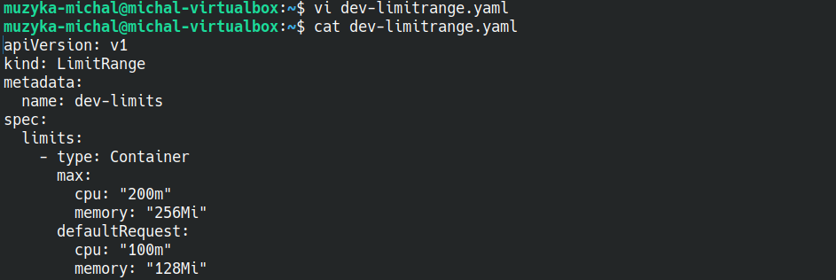

### Aplikuję manifest dla przestrzeni nazw ns-dev i weryfikuje poprawność.

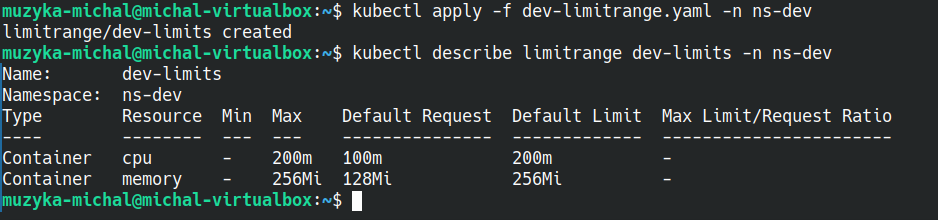

### Tworzę plik YAML obiektu Deployment o nazwie no-test na bazie obrazu nginx w przestrzeni ns-dev. Dodaję żądanie zasobów na cpu=300m, co przekracza wymagania co do wykorzystania zasobów.

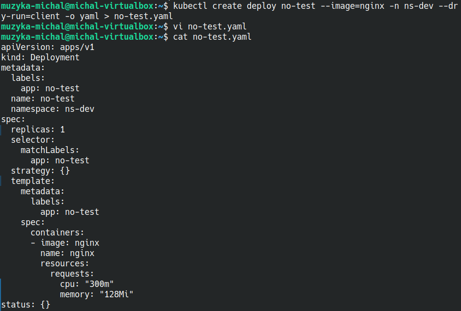

### Uruchamiam obiekt Deployment. Weryfikuję, że tworzenie poda nie powiodło się z powodu przekroczenia limitu CPU.

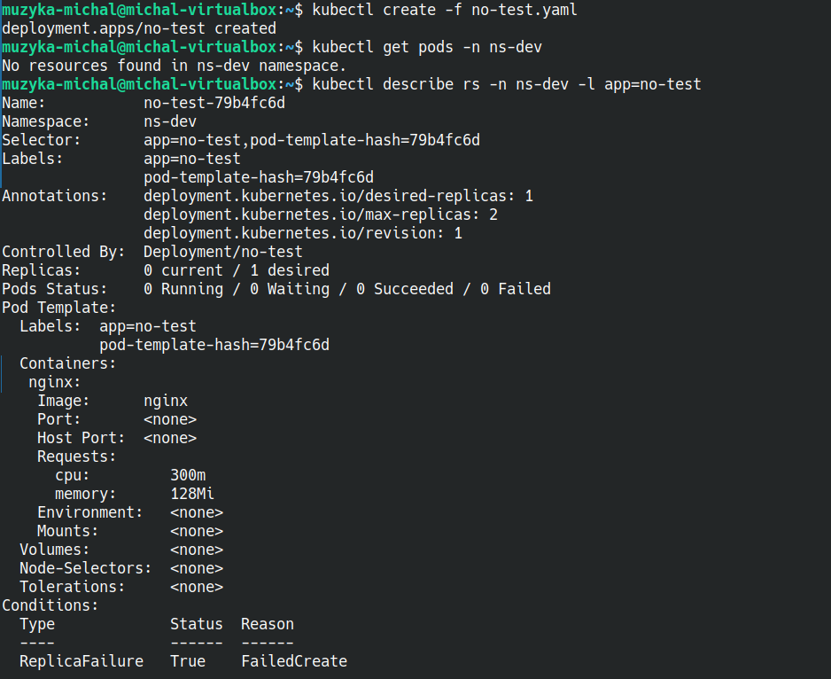
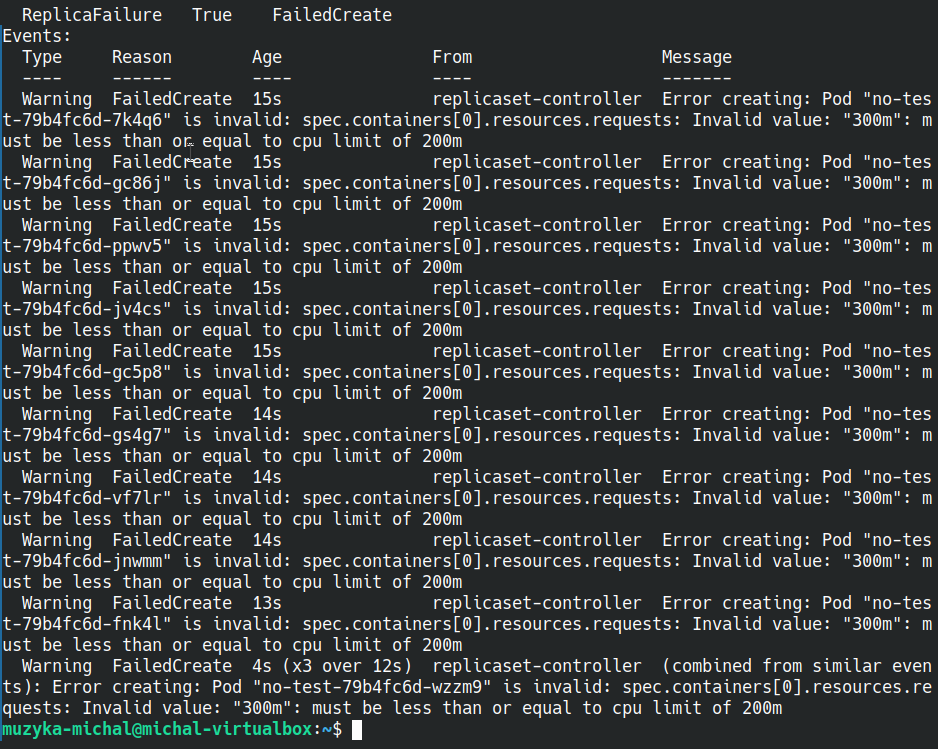

### Tworzę plik YAML obiektu Deployment o nazwie yes-test na bazie obrazu nginx w przestrzeni ns-dev. Dodaję żądanie zasobów na cpu=150m i memory=200Mi, co spełnia wymagania co do zasobów.

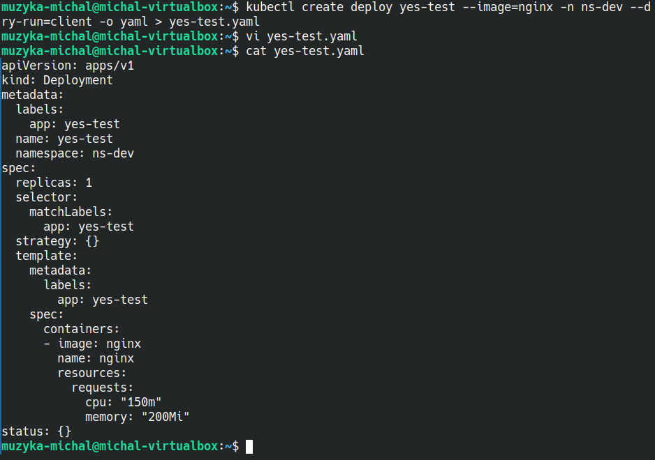

### Uruchamiam obiekt Deployment. Weryfikuję, że tworzenie poda powiodło się. Pod pomyślnie uruchomił się.

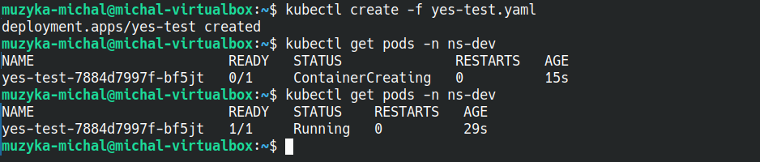

### Tworzę plik YAML obiektu Deployment o nazwie zero-test na bazie obrazu nginx w przestrzeni ns-dev bez definiowania zasobów.

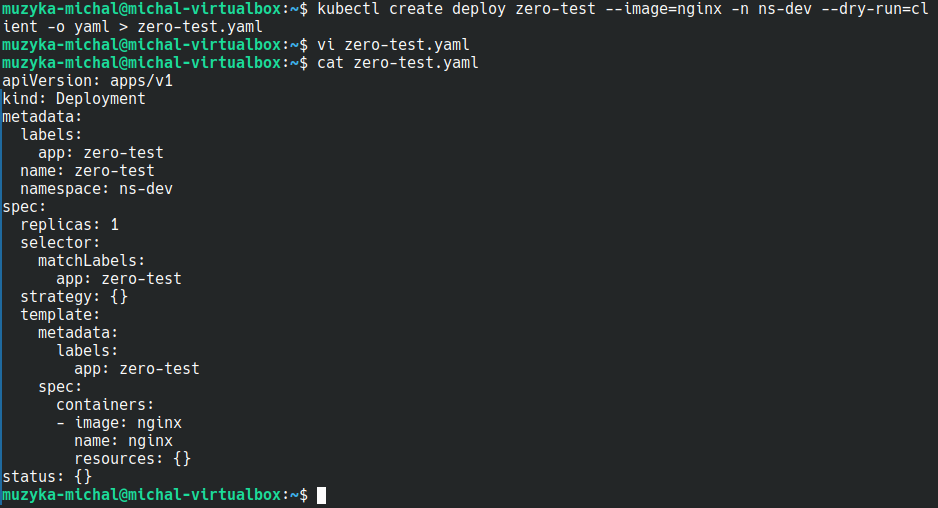

### Uruchamiam obiekt Deployment. Weryfikuję, że tworzenie poda powiodło się. Pod pomyślnie uruchomił się. Weryfikuję poprawność przypisania domyślnych zasobów. Zasoby requests i limits zostały przypisane takie, jak określono w LimitRange.

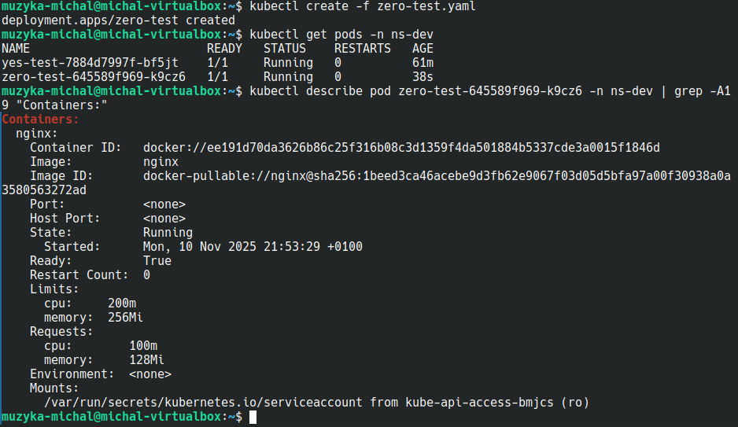
